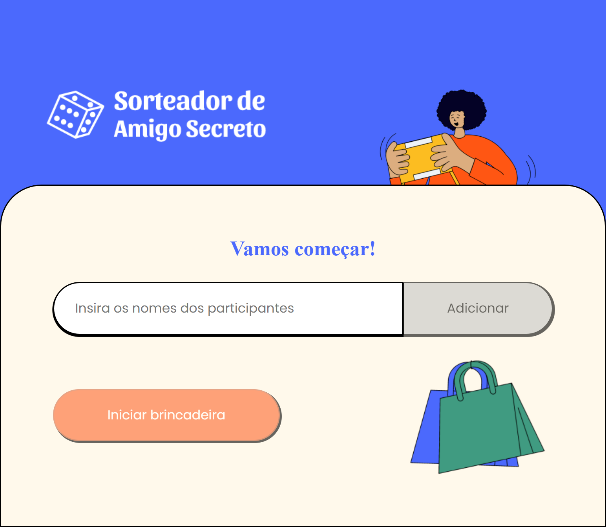
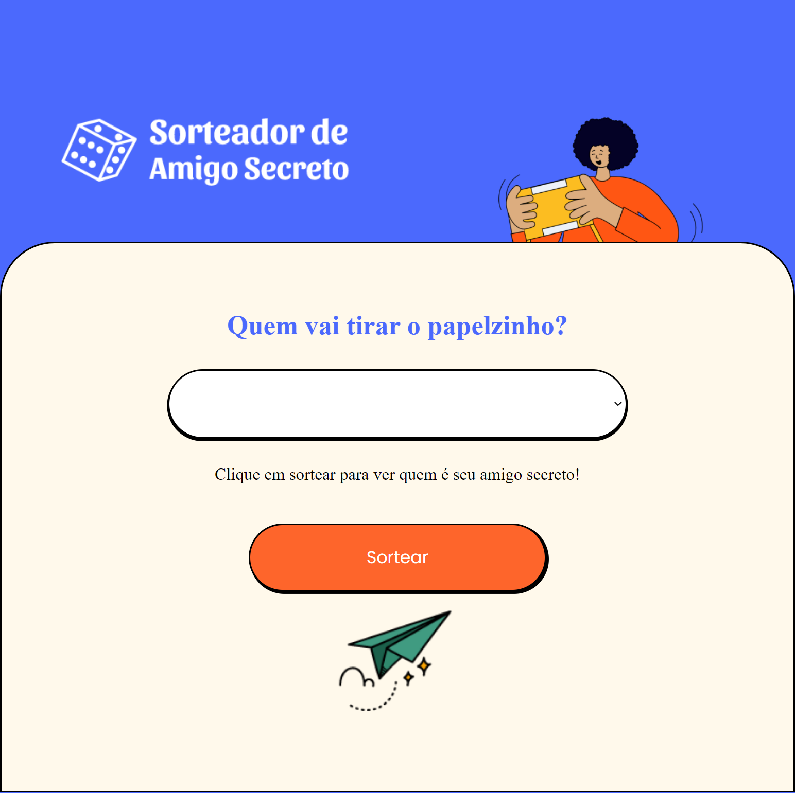
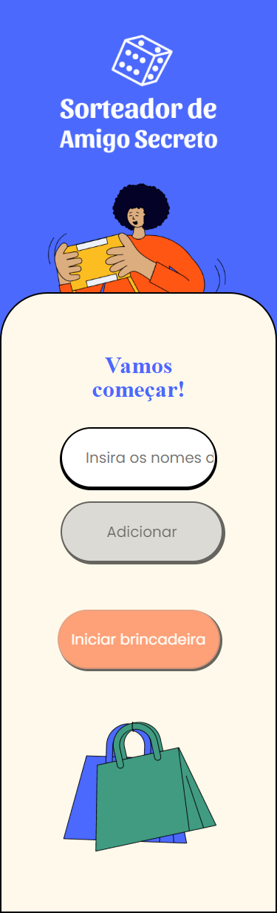
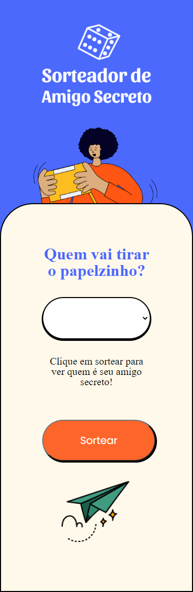

# Sorteador de Amigo Secredo

- Este Projeto foi desenvolvido durante o Curso  e React: testando os seus componentes da plataforma Alura.

### Tecnologias utilizadas:

 - TypeScript;
 - React;
 - CSS Modules;
 - Recoil;
 - react-router-dom;
 - react-testing-library;
 - just-shuffle

 ## Para executar a aplicação voce precisará:
  - Clonar este repositório;
  - Instalar as dependências `npm i`;
  - Executar o projeto `npm start`;

# Páginas da Aplicação para Desktop

### Home

### Tela de sorteio

# Páginas da Aplicação para Mobile

### Home

### Tela de sorteio

